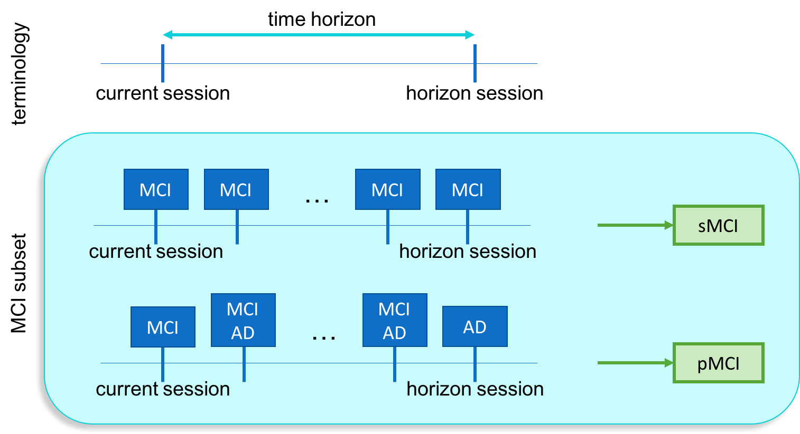

# Clinical context: Alzheimer's disease

Alzheimer’s disease (AD) is the main type of dementia, which are diseases characterised by memory troubles, behavioural changes and cognitive issues. Given that the processes causing AD start many years before the symptoms appear, it is of great importance to find a way to identify, as early as possible, if a certain subject will develop AD dementia. This is important to provide adequate care to the patient and information to the family. Moreover, this is vital in order to provide an effective treatment in the future, as therapies are more likely to be effective if administered early. It is thus important to identify which patients should be included in clinical trials and/or could benefit of the treatment.

The diagnosis of AD mainly relies on clinical evaluation and cognitive assessment using neuropsychological tests. However, diagnosis has evolved thanks to advances in neuroimaging. Neuroimaging provides useful information such as atrophy due to gray matter loss with anatomical magnetic resonance imaging (MRI) or hypometabolism with 18F-fluorodeoxyglucose positron emission tomography (FDG PET). A major interest is then to analyse those markers to identify dementia at an early stage.

## Publicly available Alzheimer's disease datasets

The first thing that we need to start working on MRI classification is a dataset. Three publicly available datasets have been mainly used for the study of AD: the Alzheimer’s Disease Neuroimaging Initiative (ADNI), the Australian Imaging, Biomarkers and Lifestyle (AIBL) and the Open Access Series of Imaging Studies (OASIS).

### ADNI
The primary goal of [ADNI](http://adni.loni.usc.edu/) has been to test whether MRI, PET, other biological markers, and clinical and neuropsychological assessment can be combined to measure the progression of mild cognitive impairment and early AD. The ADNI study is composed of 4 cohorts: ADNI-1, ADNI-GO, ADNI-2 and ADNI-3. These cohorts are dependant and longitudinal, meaning that one cohort may include the same patient more than once and that different cohorts may include the same patients.

### AIBL
Similarly to ADNI, [AIBL](https://aibl.csiro.au/adni/index.html) seeks to discover which biomarkers, cognitive characteristics, and health and lifestyle factors determine the development of AD. The AIBL project includes a longitudinal cohort of patients. Several modalities are present in the dataset, such as clinical and imaging (MRI and PET) data, as well as the analysis of blood and CSF samples.

### OASIS
The [OASIS](https://www.oasis-brains.org/) project includes three cohorts, OASIS- 1, OASIS-2 and OASIS-3. The first cohort is only cross-sectional, whereas the other two are longitudinal. Available data is more limited than in ADNI with only few clinical tests and imaging data (MRI, and PET only in OASIS-3).

*Data  used  in this  tutorial  were  obtained  from  the  ADNI  database ([adni.loni.usc.edu](http://adni.loni.usc.edu/)) and the OASIS project ([www.oasis-brains.org](https://www.oasis-brains.org/)).*

## Labels of interest in the context of Alzheimer's disease

During the evolution of the disease, the diagnostic status of the participants may progress from cognitively normal, then to mild cognitive impairment, and finally to AD dementia. This diagnostic status is established by clinicians based on cognitive scores such as the Mini-Mental State Evaluation (MMSE) and the Clinical Dementia Rating (CDR). Even though assessment protocols are standardized, these scores can be highly variable based on the examiner and the physical/psychological condition of the patient during the test.

> The goal of ADNI neuropsychological testing is to use standardized procedures to objectively and reliably assess a subject’s cognitive abilities.  However, **neuropsychological testing is not a mechanical process**. The examiner encounters a wide range of emotional and physical problems that can interfere with testing, and the skill and judgment of the examiner often affect the subject’s willingness to be tested and the effort he/she invests.

<i>
 Excerpt from the <a href="http://adni.loni.usc.edu/wp-content/uploads/2010/09/ADNI_GeneralProceduresManual.pdf">ADNI general procedure manual</a>, p.76 
</i>

To limit the influence of the variabilities in the results of neuropsychological tests, diagnostic labels can be defined based on the stability of the diagnostic status over time:
- **CN** (cognitively normal): corresponds to subjects who were diagnosed as _cognitively normal_ during all their follow-up;
- **AD** (Alzheimer's disease): corresponds to subjects who were diagnosed as _demented_ during all their follow-up;
- **MCI** (mild cognitive impairment): corresponds to subjects who were diagnosed as _mild cognitive impairment_ at baseline, who did not encounter multiple reversions and conversions and who did not convert back to cognitively normal;
- **pMCI** (progressive MCI): corresponds to sessions of subjects who were diagnosed as _mild cognitive impairment_ at baseline, and _progressed to dementia_ during the  36 months (time horizon) following the current visit;
- **sMCI** (stable MCI): correspond to sessions of subjects who were diagnosed as _mild cognitive impairment_ at baseline, _remained stable_ during the  36 months (time horizon) following the current visit and _never progressed to dementia_.

<b>Time horizon:</b>

    In this notebook, we set the time horizon to 36 months.
    The time horizon allows us to study the stability of MCI patients and to sort them between sMCI and pMCI classes.

    

## A word on the OASIS dataset

For this tutorial we have chosen to use [OASIS-1](https://www.oasis-brains.org/) because of its easy access, however it is quite different from other commonly used datasets ADNI and AIBL.

In OASIS-1, only two diagnostic status are given:
- CN (corresponding to a null CDR),
- AD (corresponding to a non-null CDR).

This definition of the diagnostic status does not correspond to the one of ADNI for which it is based on other neuropsychological scores corrected by the level of education of participants. Moreover, in ADNI, a CDR of 0.5 leads to the MCI status whereas in OASIS it corresponds to "probable AD" as for all patients with a non-null CDR.

Finally, be aware that the OASIS-1 dataset is cross-sectional and not longitudinal, meaning that there is only one asssessment per participant. This also means that the stability of the diagnostic status cannot be assessed.
