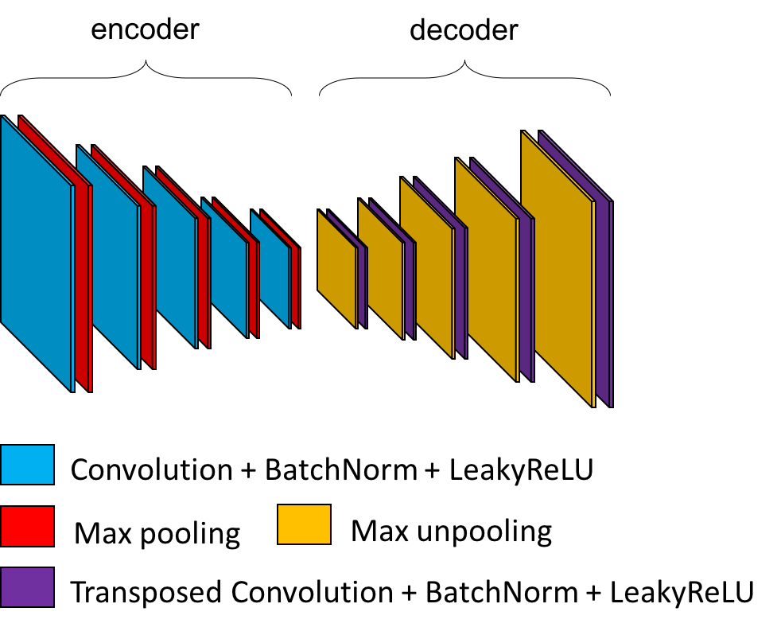

# Deep learning classification: application to neuroimaging

Deep learning is an illed-defined term that may refer to many different concepts. In this notebook, deep learning designate methods used to optimize a **network** to execute a task which success is quantified by a **loss function**. This optimization or learning process is based on a **dataset**, whose samples are used to optimize the parameters of the network.

Deep learning networks are a succession of functions (called **layers**) which transform their inputs in outputs (called **feature maps**). There are two types of layers:
- Layers including learnable parameters which will be updated to improve the loss (for example convolutions).
- Layers with fixed behaviour during the whole training process (for example pooling or activation functions).

Indeed, some characteristics are not modified during the training of the networks. These components are fixed prior to training by **hyperparameters**, such as the number of layers or intrisic characteristics of layers. In this way one of the main difficulty of deep learning is often not to train the networks, but to find good hyperparameters that will be adapted to the task and the dataset. This problem gave birth to a research field called **Neural Architecture Search** (NAS) and is not in the scope of this tutorial.

Why deep ?

Originally the term deep was used to differentiate shallow networks, with only one layer from those with two layers are more. Today the distinction is not really useful anymore as most of the networks have many more than two layers !

## Common network layers

In a deep learning network every function is called a layer though the operations layers perform are very different. You will find below a summary of the layers composing the architectures used in the following sections of this tutorial.

### Convolution

The aim of a convolution layer is to learn a set of filters (or kernels) which capture useful patterns in the data distribution. These filters parse the input feature map using translations:

A convolution layer capture local patterns that are limited to the size of its filters. However, a succession of several convolutions allows to increase the **receptive field**, i.e. the size of the region used in the input image to compute one value of the output feature map. In this way, the first layer of the network will capture local patterns in the image (edges, homogeneous regions) and the next one will assemble these patterns to form more and more complex patterns (gyri and sulci, then regions of the brain).

### Batch Normalization

This layer learns to normalize feature maps according to ([Ioffe & Szegedy, 2015](https://arxiv.org/abs/1502.03167)).  Adding this layer to a network may accelerate the training procedure.

### Activation function (Leaky ReLU)

To introduce non-linearity in the model, an activation function is introduced after the convolutions and fully-connected layers. Without activation functions, the network would only learn linear combinations !

Many activation functions have been proposed to solve deep learning problems. In the architectures implemented in `clinicadl` the activation function is Leaky ReLU:

### Pooling function

Pooling layers reduce the size of their input feature maps. Their structure is very similar to the convolutional layer: a kernel with a defined size and stride is passing through the input  However there are no learnable parameters in this layer, the kernel outputing the maximum value of the part of the feature map it covers.

Here is an example in 2D of the standard layer of pytorch `nn.MaxPool2d`:

The last column may not be used depending on the size of the kernel/input and stride value. To avoid this, pooling layers with adaptative padding were implemented in `clinicadl` to exploit information from the whole feature map.

### Dropout

Proposed by ([Srivastava et al., 2014](http://jmlr.org/papers/volume15/srivastava14a/srivastava14a.pdf)), dropout layers literally drop out (i.e. replace their values by 0) a fixed proportion of the input values. This behaviour is enabled during training to limit overfitting, then it is disabled during evaluation to obtain the best possible prediction.

### Fully-connected

Contrary to convolutions in which relationships between values are studied locally, these layers look for a global linear combination between all the input values (hence the term fully-connected).
In convolutional neural networks they are often used at the end of the architecture to reduce the final feature maps to a number of nodes equal to the number of classes in the dataset.

## Tasks & architectures

Deep learning methods have been used to learn many different task such as classification, dimension reduction, data synthesis... In this notebook we focus on **classification of images** achieved with **convolutional neural networks** (CNN).

To successfully learn a task, a network needs to analyze a high number of labeled samples. In neuroimaging, these samples are costly to acquire then many techniques such as dropout, or adding a weight decay in the optimizer. Another technique seen in this notebook consists in transferring weights learnt by an **autoencoder**. Indeed this network can learn patterns representative of the dataset in a self-supervised manner, hence it does not need labels and can be trained on all samples available.

### Classification with a CNN

A CNN takes as input an image and outputs a vector of size `C`, corresponding to the number of different labels existing in the dataset. More precisely, this vector contains a value for each class that is often interpreted (after some processing) as the probability that the input image belong to the corresponding class. Then, the prediction of the CNN for a given image corresponds to the class with highest probability in the output vector.

The cross-entropy loss is used to quantify the error made by the network during the training process, which becomes null if the network outputs 100% probability for the true class.

There are no rules on the architectures of CNNs, except that they contain convolution and activation layers. In `clinicadl`, other layers such as pooling, batch normalization, dropout and fully-connected layers are also used.

<figure>
  
    <figcaption><i>Example of a CNN architecture</i></figcaption>
</figure>

### Autoencoder pretraining

An autoencoder learns to reconstruct data given as input. It is composed of two parts:
- the `encoder` which reduces the dimensionality of the input to a smaller feature map: the code,
- the `decoder` which reconstructs the input based on the code.

The mean squared error is used to evaluate the difference between the input and its reconstruction.

There are many paradigms associated to autoencoders, but here we will only focus on a specific case that allows to obtain weights that can be transferred to a CNN. In `clinicadl`, autoencoders are designed based on a CNN:
- the `encoder` corresponds to the convolutional layers of the CNN,
- the `decoder` is composed of the transposed version of the operations used in the encoder.

After training the autoencoder, the weights in its encoder can be copied in the convolutional layers of a CNN to initialize it. This can improve its performances as the autoencoder has already learnt patterns characterizing the data distribution.

<figure>
  
    <figcaption><i>Autoencoder derived from the previous CNN architecture</i></figcaption>
</figure>

## Neuroimaging inputs

A CNN takes as input an image and learns to associate a label to it. However, most deep learning methods were originally developped for natural images which are two dimensional, whereas brain images are volumes...

The layers seen before (convolutions, pooling) were adapted to work on 3D feature maps making possible the classification of MR volumes. However to use as inputs parts of the image:
- 2D slices extracted from the volume along a particular axis,
- 3D patches, i.e. smaller 3D volumes extracted from the full image,
- Regions of Interest (ROI) defined by a neuroanatomical atlas. They can be given as volumes, using a bounding box that cover the region of the ROI or by segmenting them precisely and setting the voxels that do not belong to the region to 0. It is also possible to give slices of these regions.

Whereas the aim of 2D slices and 3D patches is to cover the whole brain, a selection of of ROI rely on prior knowledge on the disease studied. In the case of Alzheimer's disease study, the most affected regions for most patients is the hippocampus, thus this region has been used in several studies.
